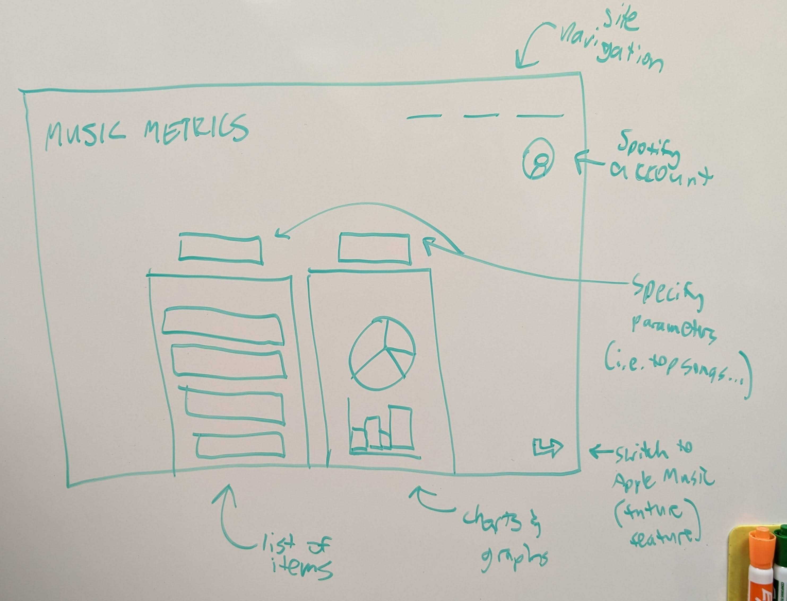

# music-metrics
Web app that provides the user with in-depth Spotify listening stats.

## Elevator Pitch

You probably have listened to music once or twice. Have you ever wondered what your top songs are, or more specifically, how many times you've listened to them? This web app will not only deliver the facts and figures that you are given by Spotify, but we will expound upon those stats to really satisfy you're itch to know about your listening history. For example, we can provide top albums, total listening time for a certain time period, and the counts for every song you've explored (all things that Spotify doesn't report directly).

## Design

## Key Features

* Ability to sign in via Spotify (possibly Apple Music in the future)
* Access to various statistics that Spotify doesn't directly provide
* Viewable charts and graphs based on usage over time
* Ability to generate new playlists based on recommended songs (maybe)

## Useful Information

* EC2 instance: t3.nano running on us-east-2
* Domain: musicmetrics.app
* Elastic IP: 3.13.23.247
* SSH into EC2 server: ssh -i id_rsa.pem ubuntu@musicmetrics.app
